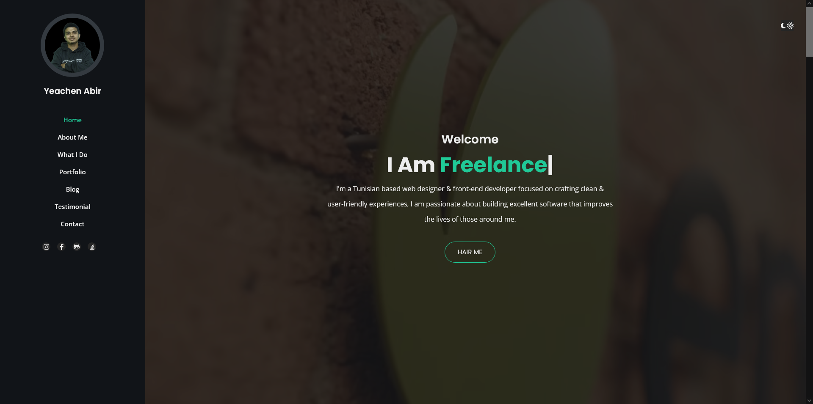

# ♣ Hello - One page html5 responsive portofolio template

**Hello** is a modern, responsive landing page template built with **html** **CSS** and **bootstrap** & more, ideal for **web developers**, **startups**, **SaaS portofolio**, and **portofolio portfolios**. Designed with clean UI/UX, speed, and SEO in mind.


---

## 🖼️ Template Banner

[Live Preview](https://mdyeachen.github.io/Hello/)

<p align="center">
  
</p>


---

## ✨ Key Features

- 🌑 Sleek **Light Themed UI**
- ⚡ Pure Html CSS & Js
- 📱 Fully Responsive Design (Mobile, Tablet, Desktop)
- 🔍 **SEO Ready** with semantic structure
- 🔧 Modern Development Stack with reusability in mind
- 🎯 Great for Developers, Portfolios & portofolio Products

---

## ⚙️ Tech Stack

- **HTML5**, **CSS3**, **Bootstrap CSS**
- **Jquery** & **fontawesome**
- **Vanilla JavaScript**
- **Responsive & Accessible Design**

---


## 💡 Why Choose the Bold Template?

✅ SEO-Friendly Markup  
✅ Fast & Responsive Layout  
✅ One Page Simplicity  
✅ Built With HTML5, CSS3 & Bootstrap  
✅ Developer Friendly & Easy to Customize  

---

## 💡 Creadit 

- [Bootstrap v5.2.3](https://getbootstrap.com/)
- [Fontawesome 6.2.1](https://fontawesome.com)
- [Hover 2.3.2](http://ianlunn.github.io/Hover/)
- [Owl Carousel v2.3.4](https://github.com/OwlCarousel2/OwlCarousel2/blob/master/LICENSE)
- [normalize v2.8.3](http://github.com/necolas/normalize.css)
- [isotop](https://isotope.metafizzy.co/)
- [jQuery v3.6.3](https://jquery.com/download/)
- [Modernizr v2.8.3](www.modernizr.com/license/)
- [GMAP3](http://gmap3.net)
- [Jarallax](https://github.com/nk-o/jarallax)
- [Animation Library](https://github.com/mattboldt/typed.js)


---

> 🚀 Use this template to launch your portofolio site, portfolio, or client project quickly and effectively.

---

## 📁 Folder Structure

```bash
.
├── index.html
├── README.md
├── assets
│   ├── css
│   │   ├── bootstrap.min.5.2.3.css
│   │   ├── fontawesome.min.6.2.1.css
│   │   ├── main-dark.css
│   │   ├── main.css
│   │   ├── normalize.css
│   │   ├── owl.carousel.min.css
│   │   ├── owl.theme.default.min.css
│   │   └── responsive.css
│   ├── images
│   │   ├── dark.jpg
│   │   ├── siteIcon.jpg
│   │   ├── testimonial.jpg
│   │   ├── blog
│   │   │   ├── blog-post-1.jpg
│   │   │   ├── blog-post-2.jpg
│   │   │   ├── blog-post-3.jpg
│   │   │   ├── blog-post-4.jpg
│   │   │   ├── blog-post-5.jpg
│   │   │   └── blog-post-6.jpg
│   │   └── Project
│   │       ├── project-1.jpg
│   │       ├── project-2.jpg
│   │       ├── project-3.jpg
│   │       ├── project-4.jpg
│   │       ├── project-5.jpg
│   │       ├── project-6.jpg
│   │       ├── project-7.jpg
│   │       ├── project-8.jpg
│   │       └── project-9.jpg
│   ├── js
│   │   ├── bootstrap.min.5.2.3.js
│   │   ├── fontawesome.min.6.2.1.js
│   │   ├── gmap3.min.js
│   │   ├── isotop.min.v3.0.6.js
│   │   ├── jarallax-video.min.js
│   │   ├── jarallax.min.js
│   │   ├── jquery.3.6.3.js
│   │   ├── main.js
│   │   ├── modernizr.js
│   │   ├── owl.carousel.min.js
│   │   └── typed.js
│   ├── svgs
│   │   ├── brands
│   │   ├── regular
│   │   └── solid
│   └── webfonts
│       ├── fa-brands-400.ttf
│       ├── fa-brands-400.woff2
│       ├── fa-regular-400.ttf
│       ├── fa-regular-400.woff2
│       ├── fa-solid-900.ttf
│       ├── fa-solid-900.woff2
│       ├── fa-v4compatibility.ttf
│       └── fa-v4compatibility.woff2
└── preview
    ├── 01.png
    └── 02.png

```

---

## 👨‍💻 Developed by Yeachen Abir

I am a passionate **Full-Stack Developer** with a strong focus on **custom website development**, **on-page SEO**, and **digital marketing** strategies. My mission is to craft web solutions that **look stunning**, **perform fast**, and **rank well** on search engines.

### 🌟 CMS Expertise:
- Shopify | BigCommerce | WordPress | Wix  
- Custom CMS with React.js & Next.js  
- eBay Store Design & Optimization  
- Walmart Marketplace Product Optimization  

### 💻 Technical Skills:
- **Frontend**: JavaScript, React.js, HTML, CSS, SCSS, Tailwind CSS, Bootstrap  
- **Backend**: Node.js, Express.js  
- **Database**: MongoDB  
- **Version Control**: Git & GitHub  

### 📈 SEO & Digital Marketing:
- Keyword Research & Meta Optimization  
- On-Page SEO & Content Enhancement  
- Technical SEO: Speed, Mobile, Schema  
- Google Analytics & Search Console  

### 🔗 Let’s Connect!
- 💼 [LinkedIn](https://www.linkedin.com/in/yeachen-abir/)  
- 📘 [Facebook Profile](https://www.facebook.com/yeachen.abir) | [Facebook Page](https://www.facebook.com/profile.php?id=61574159927866)  
- 🐦 [Twitter / X](https://x.com/YeachenA)  
- 📸 [Instagram](https://www.instagram.com/yeachenabir/)  
- 📌 [Pinterest](https://www.pinterest.com/yeachenabir/)  
- 📬 Email: [yeachenabir@gmail.com](mailto:yeachenabir@gmail.com)

---

**#yeachen #abir #webdeveloper #shopify #wordpress #ecommerce #custom_website #react_developer #next_developer #fontend_developer #full_stack_developer**

---